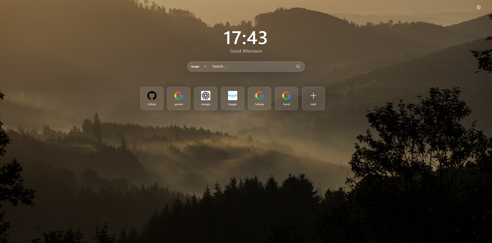
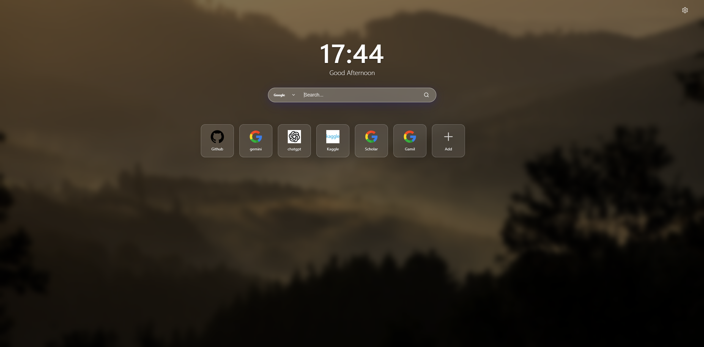

# Small Tab

[English](README.md) | 简体中文

一个轻量、可自定义的 Chrome 新标签页扩展，用简洁、个性化的面板替代默认的新标签页。

  
   
  <em>简洁的毛玻璃风格界面</em>

  
   
  <em>沉浸式搜索聚焦模式</em>

## 功能特性

- 🚀 **快速访问**：添加常用网站作为快捷方式。
- ⏰ **智能时钟**：大尺寸数字时钟，根据时间段动态显示问候语。
- 🔍 **多搜索引擎**：集成搜索栏，支持 Google、Bing 和百度。
- 💾 **数据备份**：导出和导入配置，保障数据安全。
- 🎨 **现代界面**：毛玻璃设计风格，流畅动画效果，清晰的 SVG 图标。
- 🖼️ **自定义背景**：通过 URL 设置壁纸或上传本地图片。
- ⚡ **智能图标**：自动获取快捷方式的高质量网站 Logo。
- 🌍 **国际化**：支持英文和简体中文。
- 🔒 **隐私保护**：所有数据本地存储于浏览器 (`chrome.storage.local`)，无外部服务器追踪数据。
- ⚡ **轻量级**：采用原生 JavaScript (ES Modules)、HTML 和 CSS 构建，无重型框架或库。

## 安装方法

1. 克隆或下载此仓库。
2. 打开 Chrome 并访问 `chrome://extensions/`。
3. 在右上角开启**开发者模式**。
4. 点击**加载已解压的扩展程序**。
5. 选择克隆/下载此仓库的文件夹。
6. 打开新标签页即可体验！

## 开发指南

### 项目结构

- `manifest.json`：扩展配置文件 (Manifest V3)。
- `smalltab.html`：新标签页的主入口文件。
- `scripts/`：
  - `main.js`：入口文件，处理初始化和事件绑定。
  - `ui.js`：DOM 操作和渲染逻辑。
  - `storage.js`：`chrome.storage.local` 的封装。
  - `i18n.js`：国际化辅助函数。
  - `utils.js`：工具函数。
- `styles/`：CSS 样式文件。
- `_locales/`：翻译文件。

### 参与贡献

欢迎提交 Pull Request。如有重大改动，请先提交 Issue 讨论您想要更改的内容。

## 许可证

[MIT](LICENSE)
